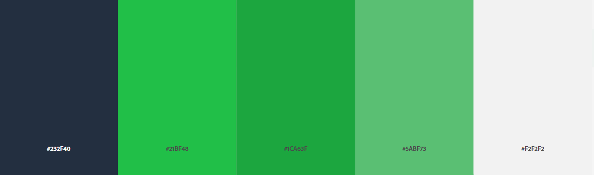

# pc2hack (PC Store Site)

Acest repo contine proiectul final la materia Tehnici Web si urmeaza sa fie un PC Store.

## Descriere pagini principale

- **Home** (pagina principala unde o sa apara diverse oferte)
- **Laptop** (pagina unde o sa apara laptop-urile din baza de date cu optiuni de sortare si filtrare)
- **PC** (pagina unde o sa apara PC-urile din baza de date cu optiuni de sortare si filtrare)
- **Monitors** (pagina unde o sa apara monitoarele din baza de date cu optiuni de sortare si filtrare)
- **Accessories** (pagina unde o sa apara perifericele din baza de date cu optiuni de sortare si filtrare)
- **FAQ** (pagine unde o sa apara cele mai frecvente intrebari puse de clienti si cu raspunsuri la acestea)
- **About us** (informatii despre companie si modalitati de contact)

## Cuvinte cheie pagini

- **Home** : _Oferta, PC, Laptop, Bun venit!, Reduceri_
- **Laptop** : _Laptop, CPU, GPU, Diagonala, RAM, Portabil, Notebook_
- **PC** : _PC, Personal Computer, Reduceri, CPU, GPU, Placa de baza, Carcasa_
- **Monitors** : _Monitor, Diagonala, inch, inches, IPS, TN, luminozitate_
- **Accessories** : _Mouse, Tastatura, Casti, Wireless, RGB, Mouse pad, Boxe_
- **FAQ** : _intrebari frecvente, raspunsuri, garantie, retur_
- **About us** : _contact, mail, facebook, instagram, numar de telefon, adresa, suport_

## Site-uri similare

1. [eMAG](https://www.emag.ro/)
    - Pro: Design atragator, lista de produse favorite
    - Contra: Prea multe produse listate pe pagina
2. [PcGarage](https://www.pcgarage.ro/)
    - Pro: Multitudinea de filtre pentru sortarea produselor
    - Contra: Design neatragator
3. [Altex](https://altex.ro/)
    - Pro: Simplitate la design
    - Contra: Putine optiuni ale site-ului
4. [ForIT](https://www.forit.ro/)
    - Pro: Usor de gasit informatia dorita
    - Contra: Prea multe imagini de tip reclama

## Color Scheme

Aceasta palera de culori este inspirata de tema site-ului [HackerRank](https://www.hackerrank.com/) si evidentiaza imbinarea unei teme de hacker cu cea a unui PC shop. Culorile sunt specifice domeniului si sunt foarte atragatoare pentru pasionati.

## Questions
